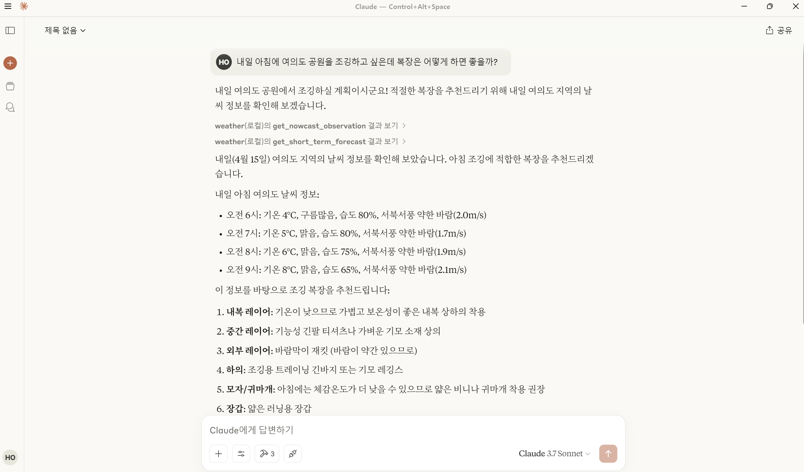

# Korea Weather MCP Server

[](https://smithery.ai/server/@ohhan777/korea_weather)

본 MCP 서버는 **기상청 단기예보 조회서비스 API**를 기반으로 동작하는 MCP 서버입니다.

## 소개

**Korea Weather MCP Server**는 기상청의 날씨 정보를 수집하여, MCP 프로토콜을 통해 Claude나 Cursor와 같은 MCP 클라이언트(Host)에 제공합니다.  
이 서버는 기상 정보를 활용하는 다양한 응용 서비스에 쉽게 연동될 수 있습니다.



## 주요 기능

- 기상청 단기예보 API 연동
- MCP 형식의 기상 정보 제공

## 설치 및 사용 방법

### Smithery를 이용한 간편 설치

1. [data.go.kr](https://www.data.go.kr/)에서 **기상청 단기예보 API**를 신청하고 API 키를 발급받습니다.  
2. 다음 명령어를 사용해 [Smithery](https://smithery.ai/server/@ohhan777/korea_weather)에서 서버를 설치하고 Claude Desktop에 등록합니다.  
   설치 과정에서 API 키 입력을 요구하면 발급받은 키를 입력합니다.
   ```bash
   npx -y @smithery/cli install @ohhan777/korea_weather --client claude
3. Claude Desktop을 재시작하여 사용하면 됩니다.

### Github에서 직접 설치하는 방법
1. [data.go.kr](https://www.data.go.kr/)에서 기상청 단기예보 API 활용 신청 후 API 키를 발급받습니다.
2. [github](https://github.com/ohhan777/korea_weather)에서 소스코드를 다운받아 실행해봅니다.
   ```
   git clone https://github.com/ohhan777/korea_weather.git
   cd korea_weather
   uv run korea_weather.py
   ```
3. MCP 클라이언트(Host)에 서버를 등록합니다.  

   - **Claude Desktop**의 설정 파일은 보통 아래 경로에 위치합니다.  
     `C:\Users\[사용자 이름]\AppData\Roaming\Claude\claude_desktop_config.json`  
     (파일이 없다면 새로 생성)

   - **Cursor**의 경우: 상단의 톱니바퀴 아이콘(⚙️) → **MCP → Add new global MCP server** 선택

   아래 예시와 같은 형식으로 설정 파일을 작성합니다. (디렉토리 경로와 API 키는 환경에 맞게 수정)

   ```json
   {
     "mcpServers": {
       "korea_weather": {
         "command": "uv",
         "args": [
           "--directory",
           "C:\\ai\\PyProjects\\korea_weather",  
           "run",
           "korea_weather.py"
         ],
         "env": {
           "KOREA_WEATHER_API_KEY": "Input Your API Key Here!"
         }
       }
     }
   }
   ```
### 프롬프트 예제
```
>> 제주 국제 공항 현재 날씨를 알려줘.
>> 내일 오후에 서울 남대문에 놀러가려고 하는데 우산을 챙겨야할까?
>> 오늘 오후에 세차하기에 괜찮은 날씨일까?
```

## 의존성

`pyproject.toml` 참고

## 라이선스

본 프로젝트는 내부 시험용으로 개발되었으며, 별도의 라이선스 규정 없이 자유롭게 배포 및 수정이 가능합니다.

## 문의

개발자: 한국항공우주연구원 오한 (ohhan@kari.re.kr)
